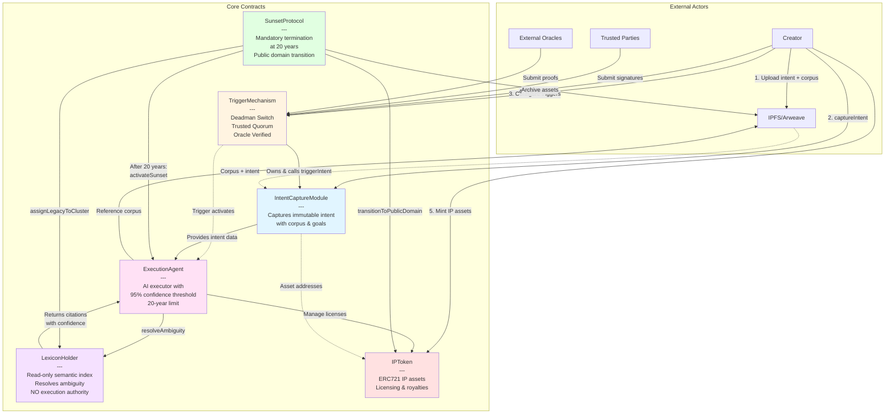

# Finite Intent Executor - System Interaction Diagram

## Overview

The Finite Intent Executor consists of 6 core smart contracts that work together to capture, trigger, execute, and sunset posthumous intent.

**Related Documentation**:
- [README.md](README.md) - Project overview and quick start
- [SPECIFICATION.md](SPECIFICATION.md) - Core specification and principles
- [ARCHITECTURE.md](ARCHITECTURE.md) - Detailed component architecture
- [USAGE.md](USAGE.md) - Practical usage guide

## System Architecture Diagram



## Detailed Interaction Flows

### 1. Intent Capture Flow
```
┌─────────┐
│ Creator │
└────┬────┘
     │
     ├─► Prepare intent document + 5-10 year corpus
     │
     ├─► Upload to IPFS/Arweave
     │   └─► Get content hashes
     │
     └─► IntentCaptureModule.captureIntent()
         ├─► Store intent hash
         ├─► Store corpus hash & URI
         ├─► Store asset URIs
         └─► Record timestamp & corpus window
```

### 2. Trigger Activation Flow
```
┌──────────────────┐
│ Trigger Condition│
└────────┬─────────┘
         │
    ┌────┴────┬────────────┬────────────┐
    │         │            │            │
    ▼         ▼            ▼            ▼
Deadman  Trusted      Oracle      Emergency
Switch   Quorum       Verified    Override
    │         │            │            │
    └────┬────┴────────────┴────────────┘
         │
         ▼
TriggerMechanism._executeTrigger()
         │
         └─► IntentCaptureModule.triggerIntent()
             └─► Intent marked as triggered
```

### 3. Execution Decision Flow
```
┌────────────────┐
│ Execute Action │
└───────┬────────┘
        │
        ▼
ExecutionAgent.executeAction()
        │
        ├─► LexiconHolder.resolveAmbiguity()
        │   ├─► Search semantic index
        │   ├─► Calculate confidence score
        │   └─► Return best citation + confidence
        │
        ├─► Check confidence >= 95%
        │
        ├─► YES: Execute & log ExecutionRecord
        │   ├─► Citation stored on-chain
        │   ├─► Confidence recorded
        │   └─► Result hash saved
        │
        └─► NO: Default to inaction
            └─► Log insufficient confidence
```

### 4. Sunset Flow (20 years after trigger)
```
┌──────────────────┐
│ 20 Years Elapsed │
└────────┬─────────┘
         │
         ▼
SunsetProtocol.initiateSunset()
         │
         ├─► Step 1: Halt Execution
         │   └─► ExecutionAgent.activateSunset()
         │
         ├─► Step 2: Archive Assets
         │   └─► Upload to IPFS/Arweave
         │       └─► Store archive hashes on-chain
         │
         ├─► Step 3: Transition IP
         │   └─► IPToken.transitionToPublicDomain()
         │       ├─► Revoke all licenses
         │       └─► Set CC0/PublicDomain flag
         │
         ├─► Step 4: Cluster Legacy
         │   └─► LexiconHolder.assignLegacyToCluster()
         │       └─► Group similar legacies
         │
         └─► Step 5: Complete Sunset
             └─► System terminates permanently
```

## Contract Dependency Matrix

| Contract | Depends On | Called By | Purpose |
|----------|-----------|-----------|---------|
| **IntentCaptureModule** | None | TriggerMechanism | Stores immutable intent |
| **TriggerMechanism** | IntentCaptureModule | External actors | Manages trigger conditions |
| **LexiconHolder** | None | ExecutionAgent, SunsetProtocol | Provides semantic resolution |
| **ExecutionAgent** | LexiconHolder | SunsetProtocol | Executes corpus-based actions |
| **SunsetProtocol** | ExecutionAgent, LexiconHolder | Anyone (after 20yr) | Enforces termination |
| **IPToken** | None | ExecutionAgent | Manages IP assets |

## Ownership & Access Control

```
┌──────────────────────┐
│ Deployment Ownership │
└──────────┬───────────┘
           │
           ├─► IntentCaptureModule
           │   └─► Owned by TriggerMechanism
           │       └─► Only TM can call triggerIntent()
           │
           ├─► ExecutionAgent
           │   └─► Has EXECUTOR_ROLE on IPToken
           │       └─► Can manage licenses
           │
           └─► All contracts
               └─► Creator retains admin rights
                   └─► Can pause/unpause if needed
```

## External Integration Points

```
┌─────────────────────────┐
│ External Integrations   │
└───────────┬─────────────┘
            │
            ├─► Decentralized Storage
            │   ├─► IPFS (primary)
            │   └─► Arweave (permanent)
            │       └─► Store: Intent, Corpus, Archives
            │
            ├─► External Oracles
            │   ├─► Medical verification
            │   ├─► Legal verification
            │   └─► Zero-knowledge proofs
            │       └─► Submit to TriggerMechanism
            │
            └─► Blockchain Networks
                ├─► Multi-chain deployment
                ├─► ERC721 standard (IPToken)
                └─► AccessControl (OpenZeppelin)
```

## Deployment Sequence

```
1. Deploy LexiconHolder
   └─► No dependencies

2. Deploy IntentCaptureModule
   └─► Standalone deployment

3. Deploy TriggerMechanism
   └─► Pass IntentCaptureModule address

4. Transfer IntentCaptureModule ownership
   └─► From deployer to TriggerMechanism

5. Deploy ExecutionAgent
   └─► Pass LexiconHolder address

6. Deploy SunsetProtocol
   └─► Pass ExecutionAgent & LexiconHolder addresses

7. Deploy IPToken
   └─► Grant EXECUTOR_ROLE to ExecutionAgent

8. Configure roles & permissions
   └─► Setup complete
```

## Key Interaction Principles

### 1. Separation of Concerns
- **IntentCaptureModule**: Captures (write-once)
- **LexiconHolder**: Indexes (read-only)
- **ExecutionAgent**: Executes (bounded)
- **SunsetProtocol**: Terminates (mandatory)

### 2. Trust Boundaries
- Creator trust: Intent capture & corpus freezing
- Execution trust: 95% confidence threshold
- Temporal trust: 20-year hard limit
- Semantic trust: Corpus-only interpretation

### 3. Control Flow
```
Intent → Trigger → Execute → Sunset
  ↓        ↓         ↓         ↓
Immutable Verified Bounded  Terminal
```

### 4. Data Flow
```
Creator Intent → Corpus → Semantic Index → Citations → Execution → Archive
     ↓             ↓           ↓              ↓           ↓          ↓
   IPFS         Frozen    Read-Only      95% Conf.   Logged    Public
```

## Critical Constraints

1. **No Political Agency**: Electoral, lobbying, policy influence prohibited
2. **95% Confidence Threshold**: All actions require high confidence
3. **20-Year Sunset**: Non-negotiable, hard-coded termination
4. **Corpus Bounds**: 5-10 year corpus window only
5. **Immutability**: Intent cannot be modified after capture
6. **No Execution Authority**: LexiconHolder is read-only
7. **Public Domain Transition**: All IP becomes CC0 at sunset

## System States

```
┌─────────────┐
│  Deployed   │
└──────┬──────┘
       │
       ▼
┌─────────────┐
│Intent Captured│
└──────┬──────┘
       │
       ▼
┌─────────────┐
│  Triggered  │ ◄── Deadman/Quorum/Oracle
└──────┬──────┘
       │
       ▼
┌─────────────┐
│  Executing  │ ◄── Years 0-20
└──────┬──────┘
       │
       ▼
┌─────────────┐
│   Sunset    │ ◄── Year 20+
└──────┬──────┘
       │
       ▼
┌─────────────┐
│ Terminated  │ (Permanent)
└─────────────┘
```

## Summary

The Finite Intent Executor is a **6-contract system** designed for posthumous intent execution:

1. **IntentCaptureModule**: Immutable intent storage
2. **TriggerMechanism**: Multi-modal activation system
3. **ExecutionAgent**: Bounded AI executor
4. **LexiconHolder**: Read-only semantic indexer
5. **SunsetProtocol**: Mandatory 20-year termination
6. **IPToken**: ERC721 IP asset management

All contracts work together to ensure **"Human intent executes faithfully beyond life, without allowing power to outlive relevance."**

---

**Next Steps**:
- For detailed component design, see [ARCHITECTURE.md](ARCHITECTURE.md)
- For usage instructions, see [USAGE.md](USAGE.md)
- For core principles, see [SPECIFICATION.md](SPECIFICATION.md)
